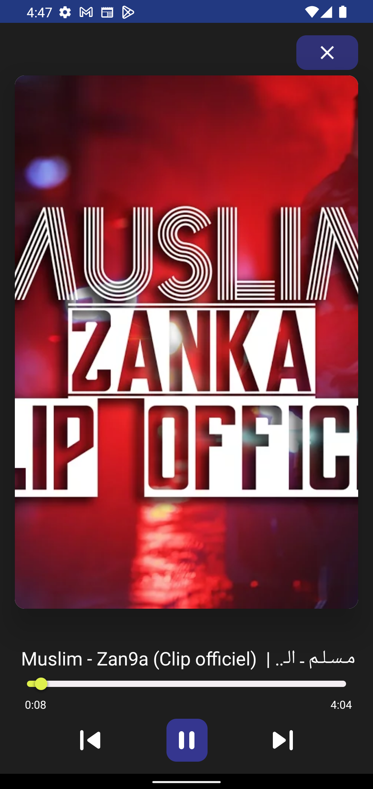

# VidMe

VidMe is a download-app that will help you save online videos or even Youtube playlists with variety of choices for the videos like saving it as Audio or Video
and deciding the video quality.

## Features

- Fetch videos from Youtube/facebook/instagram and many more.
- Fetch an entire Youtube playlist.
- Download fetched videos either as Video or Audio, and choosing the quality either Best or Worst.
- Download an entire Playlist as either Videos or Audios, and choosing the quality.
- Syncing added Playlists with Youtube.
- Deleting Playlist or single Video/Audio.

## Tools

- [Youtube-dl](https://github.com/yausername/youtubedl-android) for Android 
- Android Studio
- Figma for UI Design

## Libraries

- [Room](https://developer.android.com/training/data-storage/room) for caching
- [Hilt](https://developer.android.com/training/dependency-injection/hilt-android) for dependecy injection
- [ViewModel](https://developer.android.com/topic/libraries/architecture/viewmodel) for managing activity/fragments lifecycle. MVVM Architecture
- [Glide](https://github.com/bumptech/glide) for image loading.
- [Sdp/SSP](https://www.google.com/search?q=ssp+android+studio&sxsrf=ALiCzsatoTGPsQ1bC06l02LtMpFv20sx4Q%3A1665102193696&ei=cXE_Y42MKrKP9u8PuZW4iAg&ved=0ahUKEwjNiJSG7cz6AhWyh_0HHbkKDoEQ4dUDCA0&uact=5&oq=ssp+android+studio&gs_lcp=Cgxnd3Mtd2l6LXNlcnAQAzIICAAQgAQQywE6CggAEEcQ1gQQsAM6DQguEMcBENEDELADEEM6BggAEB4QB0oECEEYAEoECEYYAFC7AViSB2DHCGgBcAF4AIABjwGIAagDkgEDMC4zmAEAoAEByAEJwAEB&sclient=gws-wiz-serp) for responsive dimensions
- [Coroutines](https://developer.android.com/kotlin/coroutines) for asynchronous work

## Framework tools

- Android Threads
- Notifications
- Foreground service
- MediaPlayer
- VideoView with MediaController
- Files API
- Permissions

## Gallery

[Video of VidMe](https://drive.google.com/file/d/1LQeMeVnOndmyuzVucu71tALKmiEQuwyB/view?usp=sharing)

