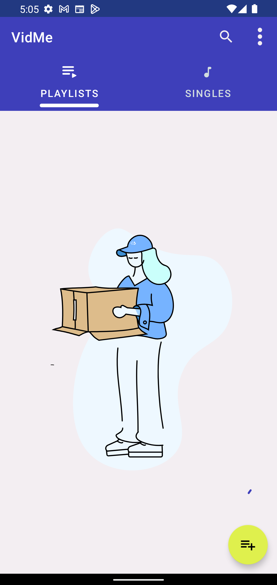

# VidMe

VidMe is a download-app that will help you save online videos or even Youtube playlists with variety of choices for the videos like saving it as Audio or Video
and deciding the video quality.

## Features

- Fetch videos from Youtube/facebook/instagram and many more.
- Fetch an entire Youtube playlist.
- Download fetched videos either as Video or Audio, and choosing the quality either Best or Worst.
- Download an entire Playlist as either Videos or Audios, and choosing the quality.
- Syncing added Playlists with Youtube.
- Deleting Playlist or single Video/Audio.

## Tools

- [Youtube-dl](https://github.com/yausername/youtubedl-android) for Android 
- Android Studio
- Figma for UI Design

## Architecture

##### MVVM with Repository, Single Activity principle. 

## Directory Structure

- __Data__: Handles the implementation of dealing with __Datasources__.
  - Datasources in VidMe are the YoutubeDL and Room.
  - _data/cache_: Contains the implmenetation of Caching method (Room).
  - _data/downloader_: Interacts with YoutubeDL to process incoming Request and returns the extracted result using the Request extractor. Each request has it's unique extractor.
  - _data/extractor_: Serializes the output of the downloader to a specific Info type.
  - _data/mapper_: Data Transfer Object (DTO) that translates a model in __Data layer__ to it's corresponding in __Domain layer__.
  - _data/pojo_: Data models that's used in Data layer scope only.
  - _data/repository_: Implementation of main repository of the application. Repository will be explained in-details in Domain layer.
  - _data/request_: Each request contains the information of what information is needed and the extractor who can extract that information.
  
- __DI__: Provides most of the dependencies that the application uses during it's lifecycle, like Downloader and Repository.

- __Domain__: The Business logic that's used in __Presentation layer__.
  - _domain/pojo_: Data models that's used in Domain layer scope and Presentaion layer.
  - _domain/repository_: Repository purpose is to combine the __Data sources__ into one single source for __Use cases__.
    - Combines between Downloader and Cache, whatever output comes from downloader is cached and then cached output is returned.
  - _domain/usecase_: Use case specifiy an action that the system provides, like FetchYoutubePlaylistInfoUseCase, it will somehow get you the playlist info.
  - _domain/util_: Provides helper methods in dealing with Files API and Strings.
  

## Libraries

- [Room](https://developer.android.com/training/data-storage/room) for caching
- [Hilt](https://developer.android.com/training/dependency-injection/hilt-android) for dependecy injection
- [ViewModel](https://developer.android.com/topic/libraries/architecture/viewmodel) for managing activity/fragments lifecycle. MVVM Architecture
- [Glide](https://github.com/bumptech/glide) for image loading.
- [Sdp/SSP](https://www.google.com/search?q=ssp+android+studio&sxsrf=ALiCzsatoTGPsQ1bC06l02LtMpFv20sx4Q%3A1665102193696&ei=cXE_Y42MKrKP9u8PuZW4iAg&ved=0ahUKEwjNiJSG7cz6AhWyh_0HHbkKDoEQ4dUDCA0&uact=5&oq=ssp+android+studio&gs_lcp=Cgxnd3Mtd2l6LXNlcnAQAzIICAAQgAQQywE6CggAEEcQ1gQQsAM6DQguEMcBENEDELADEEM6BggAEB4QB0oECEEYAEoECEYYAFC7AViSB2DHCGgBcAF4AIABjwGIAagDkgEDMC4zmAEAoAEByAEJwAEB&sclient=gws-wiz-serp) for responsive dimensions
- [Coroutines](https://developer.android.com/kotlin/coroutines) for asynchronous work
- [Truth](https://truth.dev/) for Unit testing

## Framework tools
- Android Threads
- Notifications
- Foreground service
- MediaPlayer
- VideoView with MediaController
- Files API
- Permissions

## Try it out
[VidMe](https://www.mediafire.com/file/a99yx4vah4pnjja/VidMe.apk/file)
## Gallery

[Video of VidMe](https://drive.google.com/file/d/1LQeMeVnOndmyuzVucu71tALKmiEQuwyB/view?usp=sharing)

